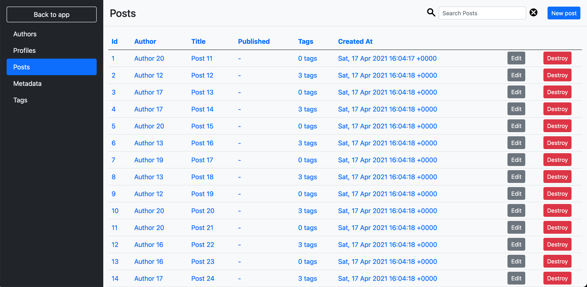

# Administrate Bootstrap Theme
A Bootstrap 5 (_beta_) theme for [Administrate](https://github.com/thoughtbot/administrate).

Features:
- easy to install, just include CSS to apply the theme to a default Administrate structure;
- customizable via SASS variables;
- allow to use *Bootstrap* components in the admin.



## Installation
- Add to the *Gemfile* (of an Administrate project): `gem 'administrate-bootstrap-theme'` (and execute `bundle`)
- Modify *app/assets/config/manifest.js*, replacing the administrate assets with:

```js
//= link administrate-bootstrap-theme/theme.css

// OFF link administrate/application.css
// OFF link administrate/application.js
```

- Edit *app/views/layouts/admin/application.html.erb* (you can generate it using `rails generate administrate:views:layout`),
  adding before head closing tag:

```html
<%= stylesheet_link_tag 'administrate-bootstrap-theme/theme', media: 'all' %>
```

## Customizations
To change variables it's necessary to create a new *.scss* (or *.sass*) file like this one (ex. *admin.scss*):

```scss
// app/assets/stylesheets/admin.scss
$navigation-width: 300px;
@import 'administrate-bootstrap-theme/theme';
```

And replace the link tag in the *application.html.erb* with: `<%= stylesheet_link_tag 'admin', media: 'all' %>`

For the complete list of options take a look [here](app/assets/stylesheets/administrate-bootstrap-theme/_variables.scss).

## Do you like it? Star it!
If you use this component just star it. A developer is more motivated to improve a project when there is some interest.

Or consider offering me a coffee, it's a small thing but it is greatly appreciated: [about me](https://www.blocknot.es/about-me).

## Contributors
- [Mattia Roccoberton](https://blocknot.es/): author

## License
The gem is available as open source under the terms of the [MIT License](https://opensource.org/licenses/MIT).
