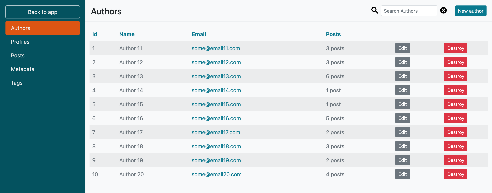

# Administrate Bootstrap Theme
[](https://badge.fury.io/rb/administrate-bootstrap-theme)
[](https://rubygems.org/gems/administrate-bootstrap-theme) 
[](https://github.com/blocknotes/administrate-bootstrap-theme/actions/workflows/linters.yml)
[](https://github.com/blocknotes/administrate-bootstrap-theme/actions/workflows/specs.yml)

A Bootstrap 5 theme for [Administrate](https://github.com/thoughtbot/administrate).

Features:
- easy to install: just run the generator installer;
- customizable via SASS variables;
- allow to use *Bootstrap* components in the admin.

See some [screenshots](#screenshots).

Please :star: if you like it.

## Installation

- Add to *Gemfile* (of an Administrate project): `gem 'administrate-bootstrap-theme', '~> 1.0'` (and execute `bundle`)
- Run the installer: `bin/rails generate administrate_bootstrap_theme:install`

## Customizations

Edit the variables define in *app/assets/stylesheets/administrate-bootstrap-theme.scss*:

```scss
$navigation-bg: #055160;
$navigation-bg-active: #d51;
$navigation-width: 300px;
$primary: #087990;

@import 'administrate-bootstrap-theme/theme';
```

### Extra improvements

Set a UI font:

- you can of course import any font from Google fonts (or other providers);
- to use a pre-configured one, add to *app/assets/stylesheets/administrate-bootstrap-theme.scss*:
```scss
@import 'administrate-bootstrap-theme/fonts/roboto';
// @import 'administrate-bootstrap-theme/fonts/lato';
// @import 'administrate-bootstrap-theme/fonts/montserrat';
// @import 'administrate-bootstrap-theme/fonts/open_sans';
// @import 'administrate-bootstrap-theme/fonts/source_sans_pro';
```

For more improvements to the sidebar:

- generate the navigation partial: `bin/rails generate administrate:views:navigation`
- edit the partial *app/views/admin/application/_navigation.html.erb*
- to change the _Back to app_ button to a title component: replace the classes for the first link (_back_to_app_) with `button--title`
- update the translation button title editing *config/locales/en.yml*:
```yml
en:
  administrate:
    navigation:
      back_to_app: 'MyAdmin'
```
- to add a copyright line at the bottom, update the links part with:
```erb
<div class="mb-auto">
  <% Administrate::Namespace.new(namespace).resources_with_index_route.each do |resource| %>
    ...
  <% end %>
</div>
<div class="copy">by Mat</div>
```

## Screenshots

- Index page: 
- Show page: 
- Form page: 
- Index page with some customized colors: 

## Do you like it? Star it!

If you use this component just star it. A developer is more motivated to improve a project when there is some interest.

Or consider offering me a coffee, it's a small thing but it is greatly appreciated: [about me](https://www.blocknot.es/about-me).

## Contributors

- [Mattia Roccoberton](https://blocknot.es/): author

## License

The gem is available as open source under the terms of the [MIT License](https://opensource.org/licenses/MIT).
